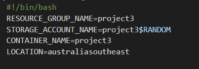
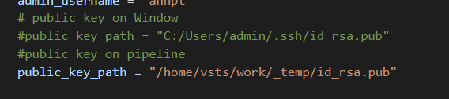
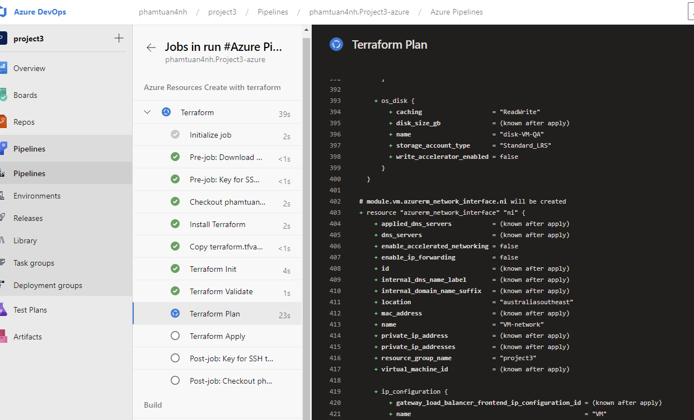
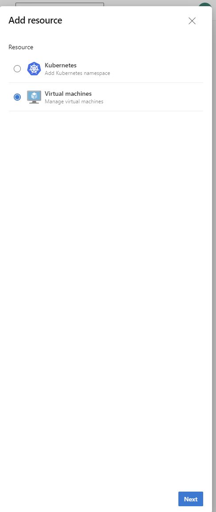
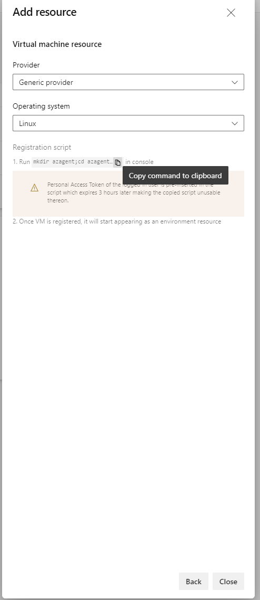
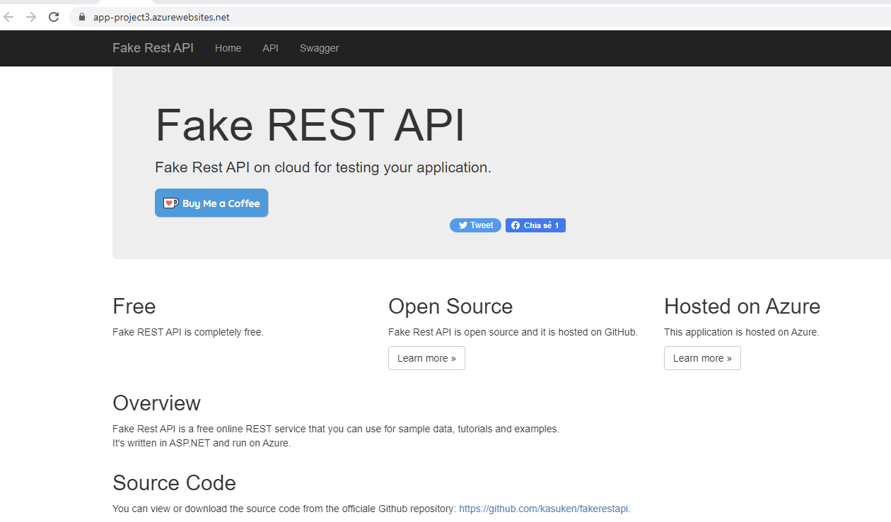

# Overview

Test Automation with Azure DevOps - Terraform - JMeter -Selenium - Postman

* To use  a variety of industry leading tools, especially Microsoft Azure, to create disposable test environments and run a variety of automated tests with the click of a button.

# Instructions

## Dependencies
| Dependency | Link |
| ------ | ------ |
| Git Bash | https://git-scm.com/downloads (If you want to run bash on window) |         
| Packer | https://www.packer.io/ |
| Terraform | https://www.terraform.io/downloads.html |
| JMeter |  https://jmeter.apache.org/download_jmeter.cgi|
| Postman | https://www.postman.com/downloads/ |
| Python | https://www.python.org/downloads/ |
| Selenium | https://sites.google.com/a/chromium.org/chromedriver/getting-started |
 
## Steps

**1. Clone this repo:**

**Type command : git clone git@github.com:phamtuan4nh/Project3-azure.git

**2. Open a Terminal in VS Code and connect to your Azure Account** 
Choose tab "Terminal" -> "New terminal" -> Choose "Git bash" 
  
  
**On terminal :**  
Type command : az login -> login azure with username password -> success if see like this  
  

**3. Configure storage account to Store Terraform state**

**Run script storage_account.sh** :
In folder you just clone from GitHub -> select filename like : storage_account.sh -> Run script with command :  sh storage_account.sh  
You can edit value or let to default  
  

* Copy output **STORAGE_ACCOUNT_NAME**, **CONTAINER_NAME**, **RESOURCE_GROUP_NAME** for use in the next steps

  

**4. Edit file main.tf**

In folder you just clone from GitHub -> Choose filename : main.tf and terraform.tfvars -> edit value with result step above like this  
  
  

**5. Create VM image using Packer**
> Go to the directory you just cloned files from git. You can see folder packer -> Go to folder and see two file name **key.json** and **server.json**  
> Type command : az ad sp create-for-rbac --role Contributor --query "{ client_id: appId, client_secret: password, tenant_id: tenant }"  
> Type command : az account show --query "{ subscription_id: id }"  
> Copy all output and then replace the value labels in the **key.json**file 
  
  
> File key.json like this  
  

> Type command : packer build -var-file=key.json server.json  
> Go azure portal -> Search service "Images" -> Check to see if the image has been created  
  
  

**6. Create public key use for SSH to VM.**

> Type command :  ssh-keygen -> you can see path like this : /c/Users/admin/.ssh/id_rsa.pub and copy and replace **public_key_path** in file **terraform.tfvars** 
  
  

Tips: if you use SSH on Azure devops, remove comment "public key on pipeline" in **terraform.tfvars**

**7. Edit terraform.tfvars** 
> like file **key.json** on step 5, edit file like this 
  

**8. Login to Azure DevOPs and create new project** 

> 8.1. Go to and login https://azure.microsoft.com/en-us/services/devops/  
> 8.2. Create new project  
  

**9. Configuring Azure Pipelines** 

> 9.1. Create the Service Connection  in Project Settings > Pipelines > Service Connection > Choose "Azure Resource Manager" > verified and authenticated and choose resource group > Save  
   

> 9.2. Go we have to navigate to Pipelines -> Library -> Secure Files  
  

> 9.3. Choose tab "Secure files" ->  "+Secure files" -> upload two file : **terraform.tfvars** and key file **id_rsa** created on step 6  
  
  

> type command : ssh-keyscan github.com -> Get your "Known Hosts Entry" is the displayed third value that doesn't begin with # in the GitBash results: 
  

> 9.4. Create groups of variables that you can share across multiple pipelines . Choose "+Variable groups" > Add name groups of variables : ssh-config > Add **knownHostsEntry**,**sshPublicKey**,**StorageAccountName (step 3)** and value this in Variables > Select type to secret > Save  
  

> 9.5. Install these Extensions:  
* Terraform (https://marketplace.visualstudio.com/items?itemName=ms-devlabs.custom-terraform-tasks&targetId=625be685-7d04-4b91-8e92-0a3f91f6c3ac&utm_source=vstsproduct&utm_medium=ExtHubManageList)  

**10. Create Azure Pipeline**

> 10.1. Tab Pipelines -> Create Pipeline -> Where is your code? Choose Github(Yaml) -> Select Repo -> Configure your pipeline
: CHoose "Existing Azure Pipelines yaml file" > Continue > Run  
  

> 10.2. Apcept permission for Azure Resources Create with terraform  
  

> 10.3. Pipeline run step like this  
  
  

> 10.4. When step deploy virtual machine(VM) if you can see error : "no resource found ...". you must Registration VM on environment Pipeline and you only need to run it once  

> 10.5. Go to Azure pipeline -> Environments -> you can see Environments name is "TEST" -> Choose and select "Add resource" -> choose "Virtual machines" > Select "Linux" and Choose icon "Copy command ..." > Close
  
  
  
  

> 10.6. SSH into VM you just created -> Enter command you just copy above step -> Run it -> Success if you see result like this 
  
  

> 10.7. Back to pipeline and re-run

**11. Report and testing**

> 11.1. App running  
   

